# Design Flow

## 1. RTL Design

The elevator controller is implemented in Verilog HDL using a finite state machine.

The controller has five main states:

- **IDLE** – Waits for a floor request.
- **MOVE_UP** – Moves the elevator upward one floor at a time.
- **MOVE_DOWN** – Moves the elevator downward one floor at a time.
- **DOOR_OPEN** – Opens the door when the target floor is reached.
- **DOOR_CLOSE** – Closes the door and returns the controller to the idle state.

The controller starts at **Floor 1** after reset.

### Verilog RTL Implementation

The following screenshots provide a visual overview of the RTL implementation. Since the complete source code is not shown in the screenshots, the full Verilog code is available in the [`Verilog_code/`](./Verilog_code/) folder.

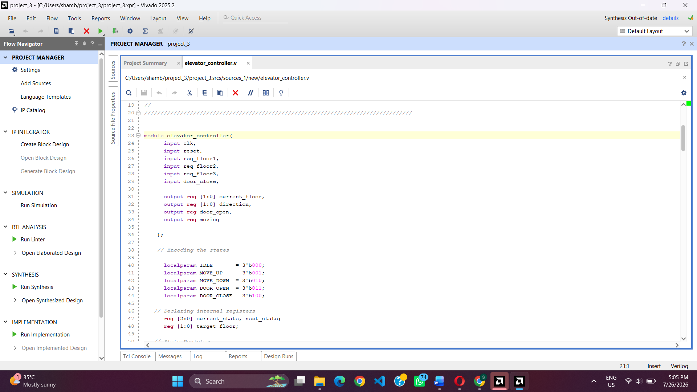

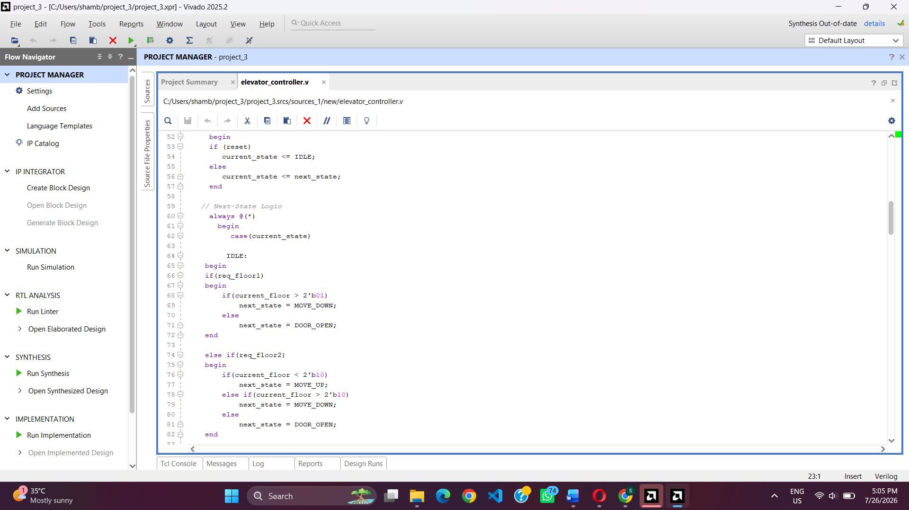

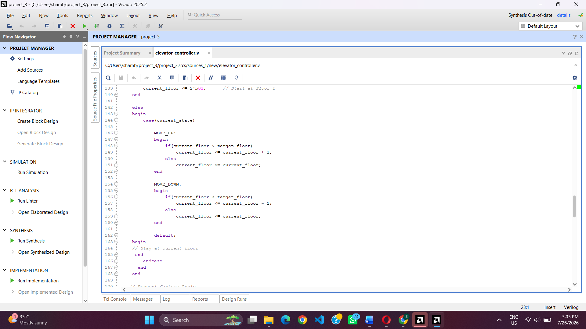

The RTL module accepts floor requests and generates the current floor, direction, door status, and movement status as outputs.

---

## 2. Testbench Development

A separate Verilog testbench was created to verify the functionality of the elevator controller.

The testbench:

- Generates a clock signal with a 10 ns period.
- Applies an active-high reset.
- Tests movement from Floor 1 to Floor 3.
- Tests movement from Floor 3 to Floor 1.
- Tests movement from Floor 1 to Floor 2.
- Verifies door opening and closing operations.
- Displays simulation progress using `$display`.

### Testbench Code

The following screenshots show parts of the testbench used for functional verification. The complete testbench source is available in the [`Testbench/`](./Testbench/) folder.

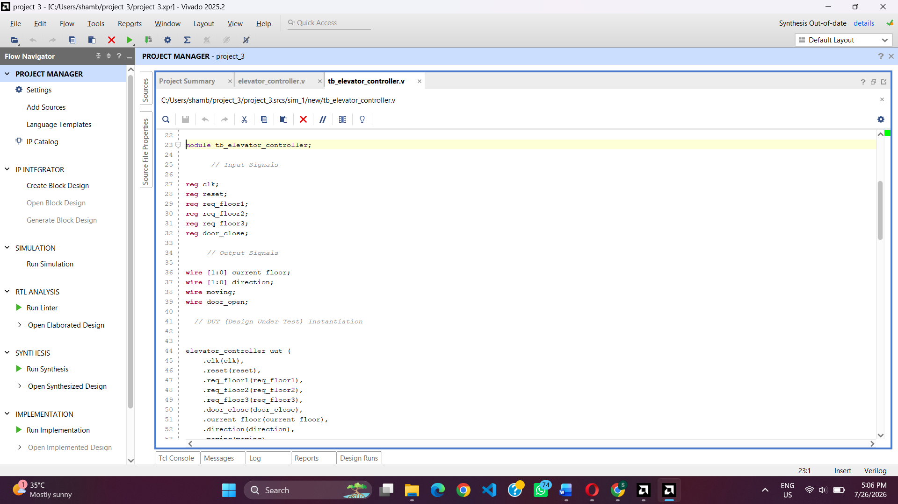

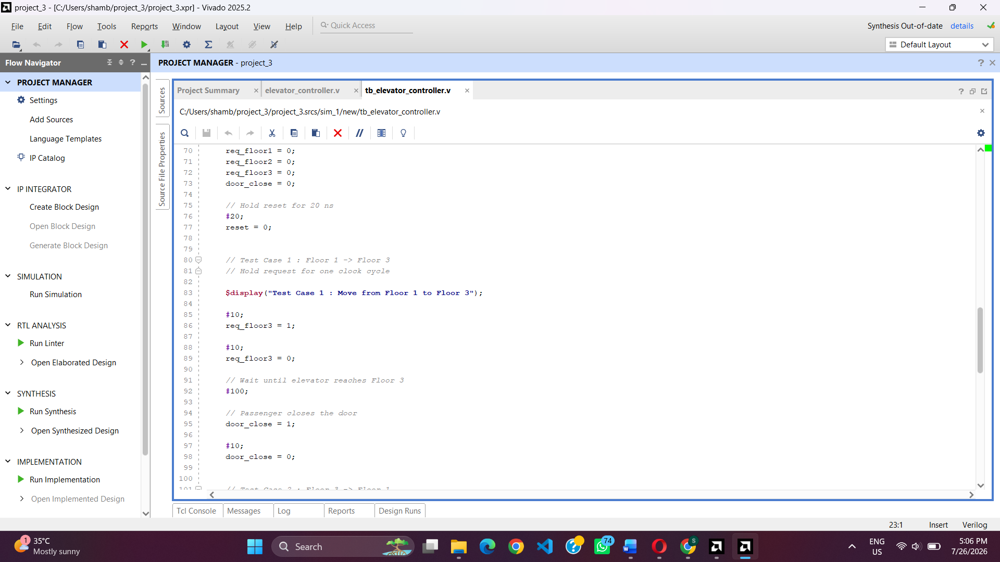

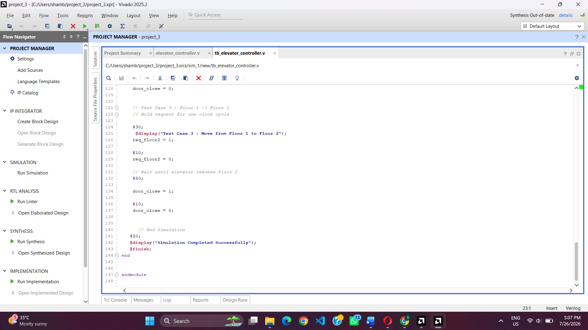

---

## 3. RTL Simulation

After completing the RTL design and testbench, the design was simulated to verify the FSM operation.

The simulation verifies:

- Reset behavior
- Floor request detection
- Elevator movement
- Upward and downward direction control
- Current floor changes
- Door opening after reaching the target floor
- Door closing and return to the idle state

### Simulation Waveform

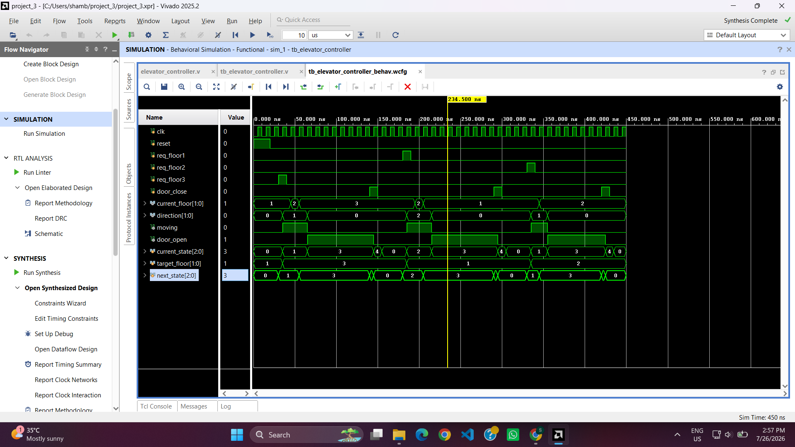

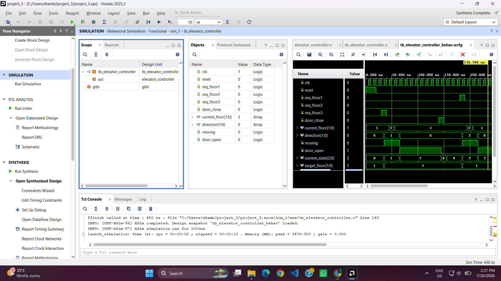

The waveform demonstrates the controller's response to multiple floor requests and shows the relationship between the clock, floor requests, current floor, direction, movement, and door signals.

### Simulation Log

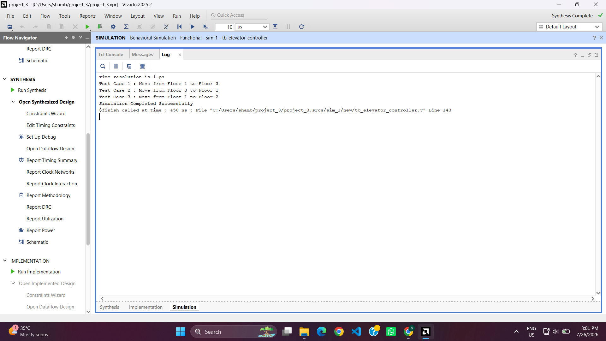

The simulation log confirms the execution of the test cases and successful completion of the simulation.

---

## 4. RTL Synthesis

After functional simulation, the Verilog RTL was synthesized to observe the hardware structure generated from the FSM-based design.

The synthesis process converts the behavioral Verilog description into a gate-level hardware representation.

### Complete Synthesized Schematic

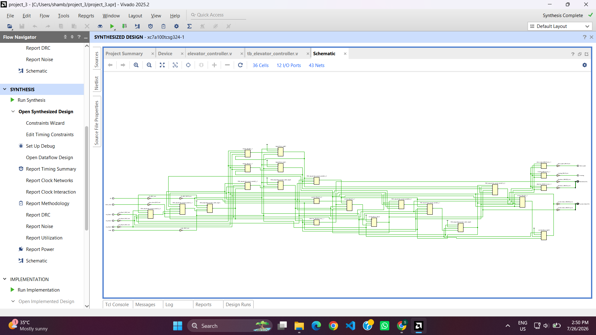

The complete synthesized schematic shows the hardware structure generated from the elevator controller RTL.

### Detailed Synthesized Schematic

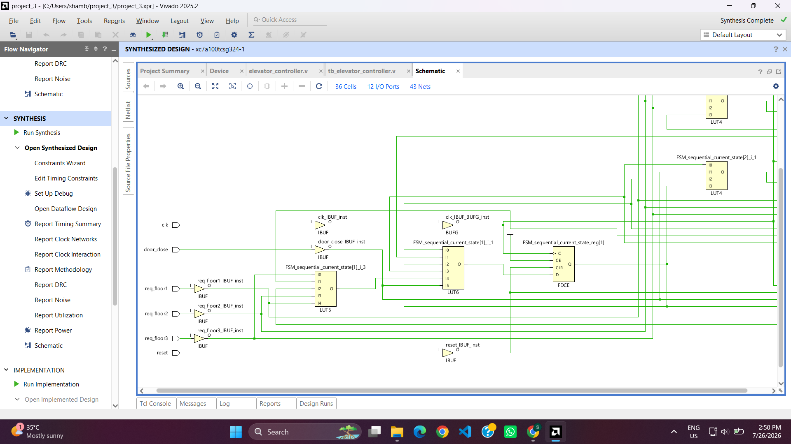

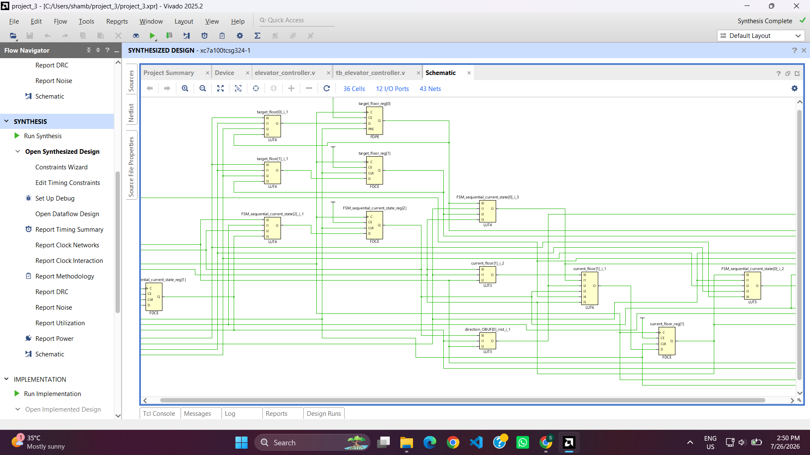

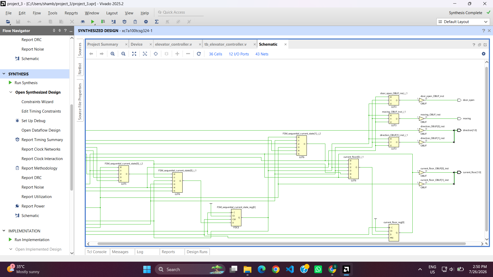

These detailed views provide a closer look at the synthesized logic and interconnections of the design.
